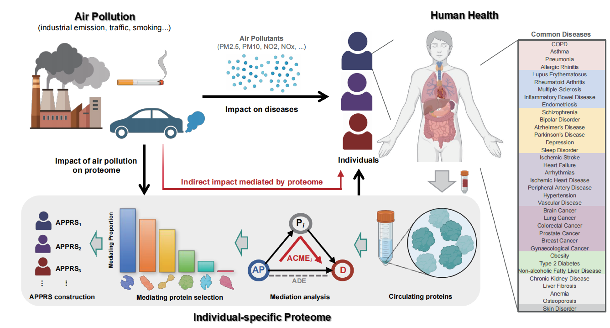

## Plasma proteome mediates the associations between air pollution exposure and disease risk



## Description
This repository provides a reproducible R codebase and figure scripts for a study on the air pollution–proteome–disease axis. It covers data derivation, proteome-wide association study (PWAS), time-to-event modeling for both air pollution and proteome predictors, causal mediation analysis identifying protein mediators, construction of an air-pollution–mediated proteomic risk score (APPRS), and predictive modeling via LASSO. The goal is to quantify the effects of ambient air pollution on disease risk and to dissect the proteomic pathways that mediate these effects.


## Methods
We implement PWAS, Cox models for air pollution ~ disease outcomes and proteome ~ disease outcomes, mediation to identify potential protein mediators, APPRS construction and airpollution interaction analyses, and LASSO-based prediction in R.


## Assets
All data used in this study were obtained from the [UK Biobank](https://www.ukbiobank.ac.uk/).
- `DataDerive/`
  - `Outcome_BasicVariables.R`: derive outcomes and baseline variables.
  - `Other_Covirates.R`: additional covariates and preprocessing helpers.
- `StatisticalAnalysis/`
  - `PWAS_Analysis.R`: PWAS workflow (limma); batch across exposures.
  - `Proteome_DiseaseOutcome_Cox.R`: proteome-disease Cox.
  - `AP_DiseaseOutcome_Cox.R`: air pollution-disease Cox.
  - `MediationAnalysis.R`: mediation analysis.
  - `APPRS_LASSO.R`: build APPRS and compare three LASSO models.
  - `APPRS_AP_Diseases_Interaction.R`: Exposure×APPRS groups and Cox interaction.
- `Figures/`: scripts to main figures
- Dependencies (R 4.1.3): `data.table (1.15.4)`, `dplyr (1.1.4)`, `tidyr (1.3.1)`, `survival (3.6-4)`, `limma (3.50.3)`, `mediation (4.5.0)`, `glmnet (4.1-8)`, `caret (6.0-94)`, `pROC (1.18.5)`, `ggplot2 (3.5.2)`, `ggpubr (0.6.0)`, `GGally (2.2.1)`, `ggrepel (0.9.5)`, `scales (1.3.0)`, `openxlsx (4.2.5.2)`.


## Citation
If you use this repository, please cite the associated manuscript once available. Provisional citation:
```
Li W, Li K, Zhou P, et al. Plasma proteome mediates the associations between air pollution exposure and disease risk. Year. Nat Commun. 
```
Manuscript under review
